# System Design: Groups SDK Chat Application

> **Version:** 0.3 | **Date:** May 8, 2026 | **Status:** Updated

A minimal chat web application showcasing the Groups SDK ecosystem (`@socialproof/myso-groups`, `@socialproof/myso-messaging-stack`, `@socialproof/mydata`) with end-to-end encryption, file attachments via File Storage, and comprehensive admin controls -- all backed by the MySo blockchain.

---

## Table of Contents

1. [High-Level Architecture](#1-high-level-architecture)
2. [Component Responsibility Matrix](#2-component-responsibility-matrix)
3. [Client Initialization Flow](#3-client-initialization-flow)
4. [Message Send Flow](#4-message-send-flow)
5. [Message Receive / Subscription Flow](#5-message-receive--subscription-flow)
6. [Admin: Atomic Remove Member + Rotate Key](#6-admin-atomic-remove-member--rotate-key)
7. [Attachment Upload Flow](#7-attachment-upload-flow)
8. [Attachment Download Flow](#8-attachment-download-flow)
9. [Group Discovery & State Management](#9-group-discovery--state-management)
10. [React Component Tree](#10-react-component-tree)
11. [Permission Model](#11-permission-model)
12. [Data Models](#12-data-models)
13. [Architecture Decision Records](#13-architecture-decision-records)
14. [Environment Configuration](#14-environment-configuration)

---

## 1. High-Level Architecture

The chat application is a React SPA that runs entirely in the browser. It delegates cryptographic operations and on-chain interactions to the SDK layer, which communicates with three external service categories: the Relayer (message storage/delivery), MyData Key Servers (threshold encryption), and the MySo network (on-chain state).

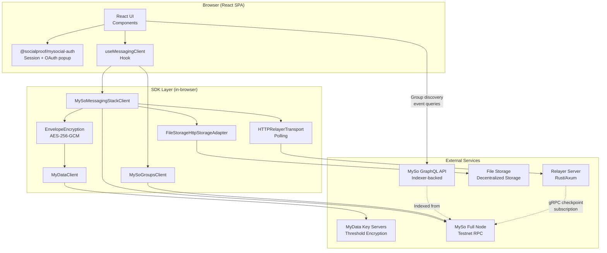

**Key architectural properties:**

- **Client-side encryption**: All message content is encrypted/decrypted in the browser. Neither the relayer nor File Storage ever see plaintext.
- **SDK composition via `$extend`**: The MySoClient is progressively extended with `mysoGroups`, `mydata`, and `mysoMessagingStack` extensions, each adding namespaced methods.
- **Deterministic addressing**: Group and EncryptionHistory object IDs are derived from a UUID via `deriveObjectID`, enabling offline ID computation without on-chain lookups.
- **Atomic transactions**: The SDK `call` layer returns async thunks that can be composed into a single Programmable Transaction Block (PTB), enabling atomic multi-step operations like "remove member + rotate key".

---

## 2. Component Responsibility Matrix

| Component | Responsibility | Package | Key Methods |
|-----------|---------------|---------|-------------|
| `MySoMessagingStackClient` | E2E encrypted messaging orchestration | `@socialproof/myso-messaging-stack` | `sendMessage`, `getMessages`, `getMessage`, `subscribe`, `editMessage`, `deleteMessage`, `createAndShareGroup`, `rotateEncryptionKey`, `leave`, `archiveGroup` |
| `MySoGroupsClient` | Member and permission management | `@socialproof/myso-groups` | `addMembers`, `removeMember`, `grantPermission`, `grantPermissions`, `revokePermission`, `revokePermissions`, `grantAllPermissions` |
| `MyDataClient` | Threshold encryption/decryption of DEKs | `@socialproof/mydata` | `encrypt`, `decrypt` (DEK key shares via threshold scheme) |
| `EnvelopeEncryption` | AES-256-GCM encrypt/decrypt of message payloads; DEK lifecycle | `@socialproof/myso-messaging-stack` | `encrypt`, `decrypt`, `generateGroupDEK`, `generateRotationDEK`, `clearCache` |
| `HybridRelayerTransport` | WebSocket + HTTP polling fallback to relayer | `@socialproof/myso-messaging-stack` | `sendMessage`, `fetchMessages`, `fetchMessage`, `updateMessage`, `deleteMessage`, `subscribe` |
| `FileStorageHttpStorageAdapter` | File upload/download to File Storage decentralized storage | `@socialproof/myso-messaging-stack` | `upload`, `download` |
| `SessionKeyManager` | MyData session key lifecycle (create, cache, refresh) | `@socialproof/myso-messaging-stack` | `getSessionKey` (internal; supports Tier 1/2/3 configs) |
| `DEKManager` | Data Encryption Key generation, MyData-encryption of new DEKs, MyData-decryption of stored DEKs | `@socialproof/myso-messaging-stack` | `generateDEK`, `decryptDEK` |
| `AttachmentsManager` | File validation, per-file AES-GCM encryption, metadata encryption, upload orchestration | `@socialproof/myso-messaging-stack` | `upload`, `resolve`, `deleteStorageEntries` |
| `MessagingGroupsDerive` | Deterministic object ID derivation from UUID | `@socialproof/myso-messaging-stack` | `groupId`, `encryptionHistoryId`, `resolveGroupRef`, `groupLeaverId`, `groupManagerId` |
| `MessagingGroupsView` | On-chain state queries (no gas, no signature) | `@socialproof/myso-messaging-stack` | `encryptedKey`, `getCurrentKeyVersion`, `currentEncryptedKey` |
| `MessagingGroupsCall` | PTB thunk builders for on-chain mutations | `@socialproof/myso-messaging-stack` | `createGroup`, `createAndShareGroup`, `rotateEncryptionKey`, `archiveGroup`, `leave`, `setGroupName`, `insertGroupData` |
| `PermissionedGroupsView` | On-chain permission/member queries | `@socialproof/myso-groups` | `isMember`, `hasPermission`, `getMembers`, `getMembersWithPermissions` |
| `MySoGraphQLClient` | GraphQL queries against the MySo indexer for event-based group discovery | `@socialproof/myso/graphql` | `query` (with `EventFilter`, `MoveValue.extract()`) |
| `useMessagingClient` | React hook providing SDK client from `MessagingClientContext` | `chat-app` | Returns memoized client with `.messaging`, `.groups`, `.mydata` (or null) |
| `useRequiredMessagingClient` | Same as above, throws if signing key is not ready | `chat-app` | Returns `{ client, signer }` (derived keypair) |
| `useGraphQLClient` | React hook providing the `MySoGraphQLClient` for event queries | `chat-app` | Returns singleton GraphQL client |
| `useGroupDiscovery` | React hook querying GraphQL events to discover user's groups | `chat-app` | Returns `{ groups, loading, refresh }` |
| `useMessages` | React hook for message CRUD + real-time subscription | `chat-app` | Returns `{ messages, sendMessage, editMessage, deleteMessage, loadMore, ... }` |
| `usePermissions` | React hook checking 7 permission types in parallel | `chat-app` | Returns `{ permissions, loading, refresh }` |

---

## 3. Client Initialization Flow

The SDK client is built once a **derived `Ed25519Keypair`** is available (OAuth session plus salt service). The `createMySoMessagingStackClient` factory composes three extensions on a fresh `MySoJsonRpcClient`. Session keys use Tier 1 `{ signer }` configuration on that keypair.

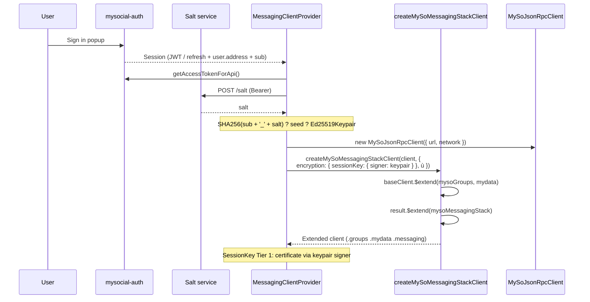

**Extension composition detail:**

The factory performs two `$extend` calls, not three. The first call registers both `mysoGroups` (as `client.groups`) and `mydata` (as `client.mydata`) since they are independent of each other. The second call registers `mysoMessagingStack` (as `client.messaging`), which depends on both prior extensions.

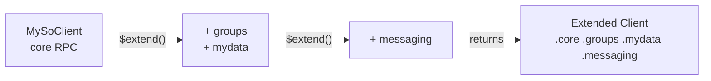

---

## 4. Message Send Flow

Sending a message involves DEK resolution (cached or fetched + MyData-decrypted), AES-256-GCM encryption of the plaintext, request signing, and HTTP delivery to the relayer.

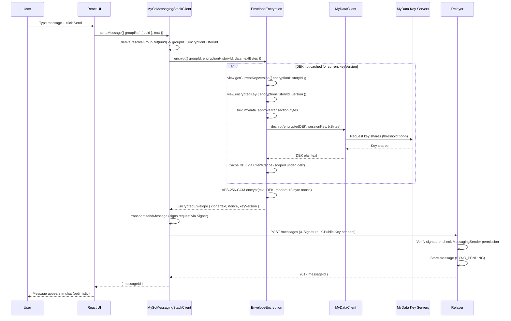

**Key details:**

- The `sendMessage` method validates that at least one of `text` or `files` is provided.
- DEK resolution uses `ClientCache.read()` with a `[groupId, keyVersion]` composite key, ensuring concurrent calls coalesce into a single MyData decryption.
- The session key is obtained internally by `SessionKeyManager.getSessionKey()` -- never passed by the caller.

---

## 5. Message Receive / Subscription Flow

The SDK's `subscribe()` method returns an `AsyncIterable<DecryptedMessage>`. By default the client uses `HybridRelayerTransport`: WebSocket for live delivery (~50ñ300ms) with HTTP polling fallback (default 3000ms interval).

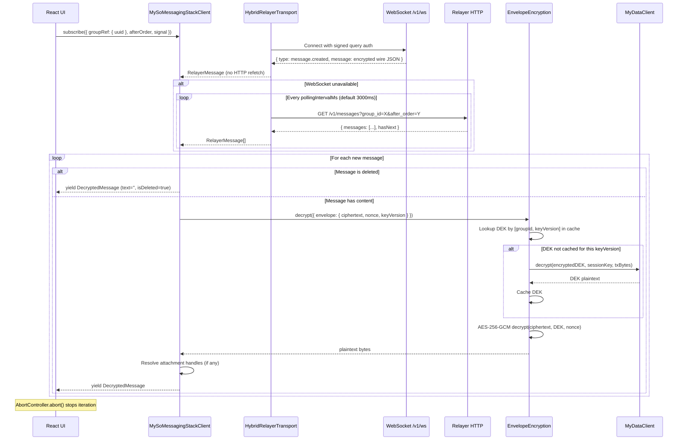

**Cancellation:** The `for await...of` loop terminates when `signal.abort()` is called, which propagates through the transport's WebSocket or polling loop. The `disconnect()` method on `MySoMessagingStackClient` also stops all active subscriptions.

---

## 6. Admin: Atomic Remove Member + Rotate Key

Removing a member without rotating the encryption key leaves them able to decrypt future messages if they cached the DEK. The SDK's `call` layer enables composing both operations into a single Programmable Transaction Block (PTB).

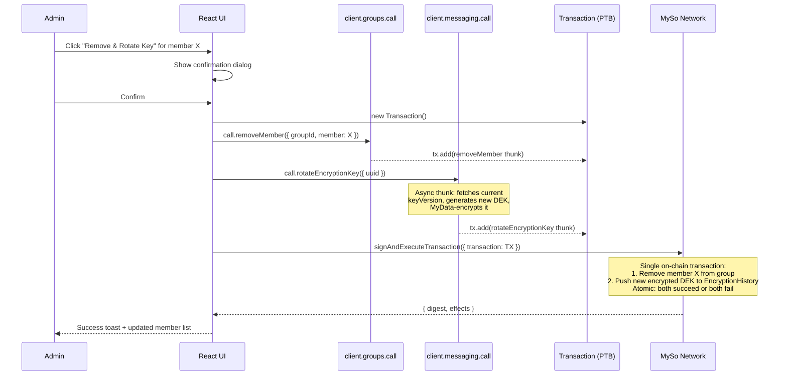

**Why this matters:**

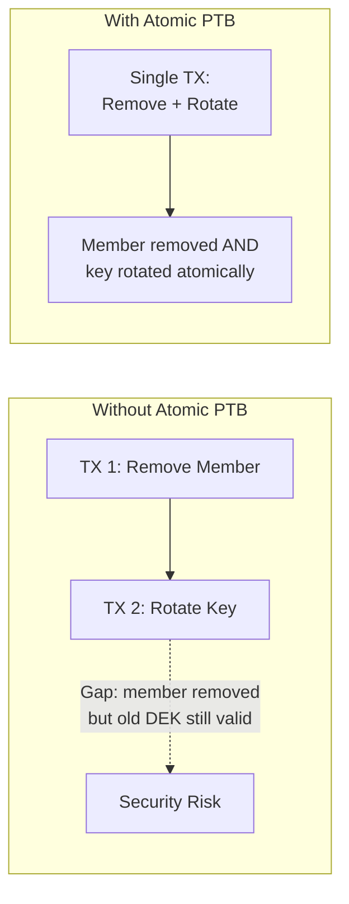

- The `call` layer methods return thunks (functions that accept a `Transaction`) rather than executing immediately.
- Async thunks (like `rotateEncryptionKey`) are resolved at `transaction.build()` time, enabling the DEK generation to happen just-in-time.
- A single wallet popup, single gas fee, and atomic execution guarantee consistency.

---

## 7. Attachment Upload Flow

File attachments are encrypted with the same DEK used for message text, then uploaded to File Storage as opaque encrypted bytes. Metadata (filename, MIME type, file size) is separately AES-GCM encrypted and stored on the relayer alongside the File Storage storage ID.

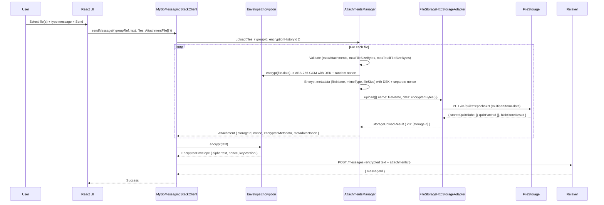

**Default limits (configurable via `AttachmentsConfig`):**

| Parameter | Default |
|-----------|---------|
| `maxAttachments` | 10 files per message |
| `maxFileSizeBytes` | 10 MB per file |
| `maxTotalFileSizeBytes` | 50 MB total per message |

---

## 8. Attachment Download Flow

Attachments use lazy download+decrypt via `AttachmentHandle`. The `data()` method is called on demand (e.g., when the user clicks a download button or when an image preview is rendered).

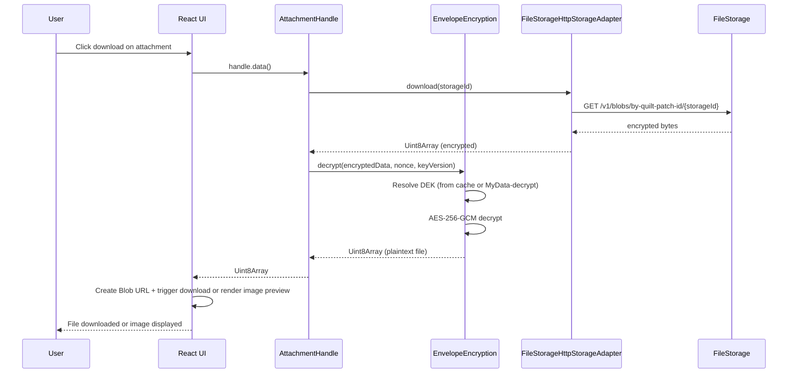

**AttachmentHandle interface:**

The `AttachmentHandle` exposes pre-decrypted metadata (filename, MIME type, size) so the UI can render file info immediately. The actual file bytes are fetched only when `data()` is called, avoiding unnecessary downloads for messages with many attachments.

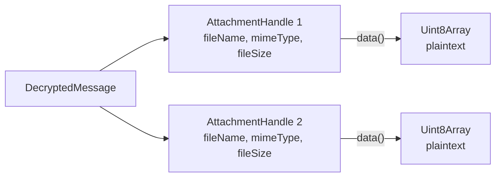

---

## 9. Group Discovery & State Management

The SDK does not provide a direct "list groups for address" method. However, the MySo GraphQL API (backed by the indexer) allows querying on-chain events to discover group memberships. The app queries `MemberAdded` and `MemberRemoved` events, filters client-side for the connected address, and caches results in localStorage.

### 9.1 Discovery via MySo GraphQL Events

The permissioned groups contract emits `MemberAdded<T>` and `MemberRemoved<T>` events containing the member's address and group ID. The MySo GraphQL API supports filtering by event type and extracting structured fields via `MoveValue.extract()`.

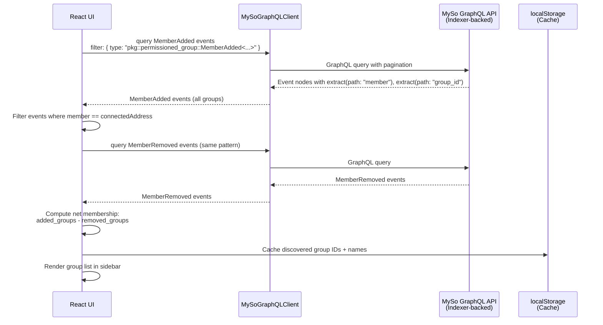

**GraphQL query pattern:**

```graphql
query DiscoverGroups($eventType: String!, $cursor: String) {
  events(
    filter: { eventType: $eventType }
    first: 50
    after: $cursor
  ) {
    pageInfo {
      hasNextPage
      endCursor
    }
    nodes {
      contents {
        json
      }
    }
  }
}
```

The event type strings are obtained from the SDK's BCS module at runtime (e.g., `client.groups.bcs.MemberAdded.name`), which resolves to the full Move type including the package ID. Each event's `json` payload contains `member` and `group_id` fields, which are filtered client-side for the connected address.

> **Note:** The `EventFilter` does not support filtering by payload fields (e.g., member address) at the query level. The app fetches all `MemberAdded` events for the package type and filters client-side. For testnet demo scale, this is efficient.

### 9.2 Discovery Architecture

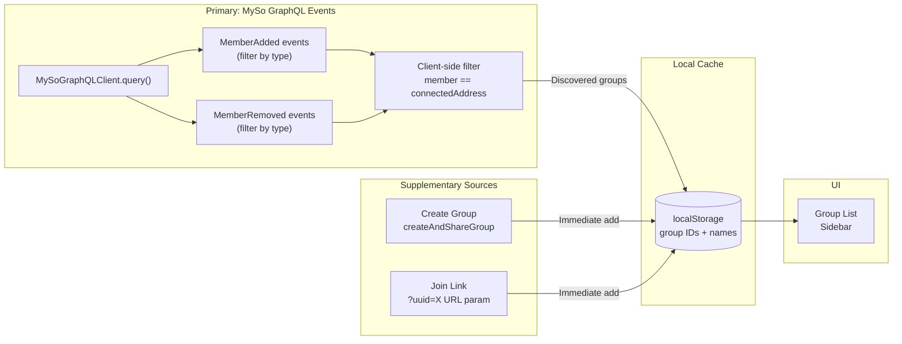

### 9.3 Group lifecycle

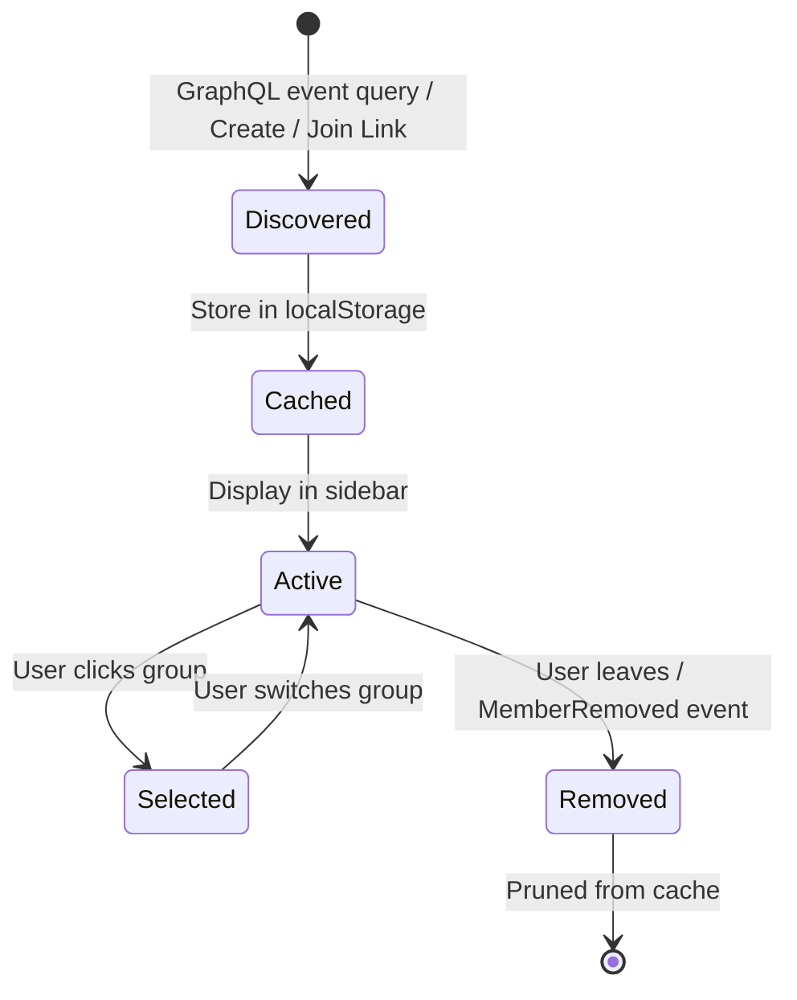

### 9.4 Caching strategy

- **On app load**: Check localStorage cache first for instant sidebar render, then refresh from GraphQL in the background
- **On group create**: Immediately add to cache (no need to wait for event indexing)
- **On join link**: Validate membership via `isMember()`, then add to cache
- **Periodic refresh**: Re-query GraphQL events periodically or on focus to catch external membership changes (e.g., admin added you to a new group)

---

## 10. React Component Tree

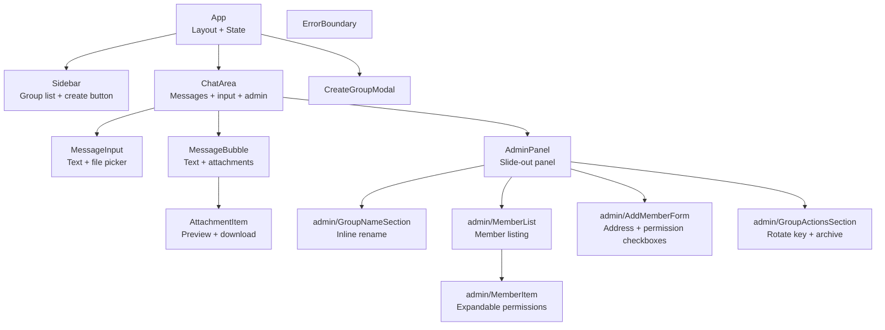

**Provider hierarchy (from `main.tsx`):**

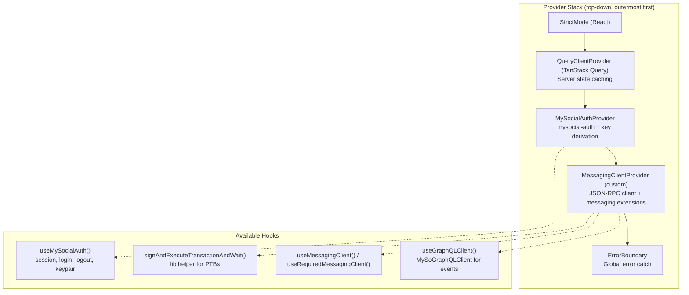

---

## 11. Permission Model

Permissions are stored on-chain in the `PermissionedGroup<Messaging>` object's permissions table. Each permission is a Move type name string (using the original V1 package ID). The SDK exposes `messagingPermissionTypes(packageId)` to generate these type strings.

| Permission Type | Friendly Name | UI Capability | SDK Method | Package |
|----------------|---------------|---------------|------------|---------|
| `MessagingSender` | Can Send Messages | Show message input | `sendMessage()` | `@socialproof/myso-messaging-stack` |
| `MessagingReader` | Can Read Messages | Show message history | `getMessages()`, `subscribe()` | `@socialproof/myso-messaging-stack` |
| `MessagingEditor` | Can Edit Messages | Show edit button on own messages | `editMessage()` | `@socialproof/myso-messaging-stack` |
| `MessagingDeleter` | Can Delete Messages | Show delete button on own messages | `deleteMessage()` | `@socialproof/myso-messaging-stack` |
| `EncryptionKeyRotator` | Can Rotate Keys | Show rotate key button | `rotateEncryptionKey()` | `@socialproof/myso-messaging-stack` |
| `MetadataAdmin` | Can Edit Metadata | Show rename/metadata controls | `setGroupName()`, `insertGroupData()`, `removeGroupData()` | `@socialproof/myso-messaging-stack` |
| `GroupHandleAdmin` | Can Manage Group Handle | (Not exposed in demo UI) | `setGroupHandle()`, `clearGroupHandle()` | `@socialproof/myso-messaging-stack` |
| `PermissionsAdmin` | Can Manage Permissions | Show admin panel, add/remove members | `grantPermission()`, `removeMember()`, `addMembers()` | `@socialproof/myso-groups` |
| `ExtensionPermissionsAdmin` | Can Manage Extension Perms | (Implicit, not shown separately) | `objectGrantPermission()`, `objectRevokePermission()` | `@socialproof/myso-groups` |
| `ObjectAdmin` | Can Manage Group Lifecycle | Show archive button | `archiveGroup()` | `@socialproof/myso-groups` |

**Permission enforcement flow:**

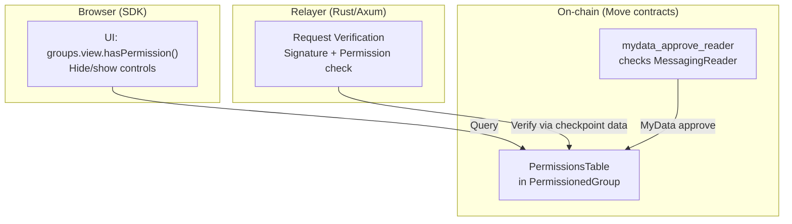

The permission model has three enforcement points:
1. **UI layer**: Queries `hasPermission()` to conditionally render controls (advisory only).
2. **Relayer**: Verifies request signatures and checks on-chain permissions before accepting messages.
3. **On-chain**: MyData `mydata_approve_reader` function validates `MessagingReader` permission before releasing DEK key shares, ensuring only authorized members can decrypt.

---

## 12. Data Models

### DecryptedMessage (from SDK)

```typescript
interface DecryptedMessage {
  messageId: string;
  groupId: string;
  order: number;
  /** Decrypted plaintext. Empty string for deleted or attachment-only messages. */
  text: string;
  senderAddress: string;
  createdAt: number;
  updatedAt: number;
  isEdited: boolean;
  isDeleted: boolean;
  syncStatus: SyncStatus;
  /** Resolved attachment handles with lazy data download. */
  attachments: AttachmentHandle[];
}

type SyncStatus =
  | 'SYNC_PENDING'
  | 'SYNCED'
  | 'UPDATE_PENDING'
  | 'UPDATED'
  | 'DELETE_PENDING'
  | 'DELETED';
```

### AttachmentHandle (lazy download)

```typescript
interface AttachmentHandle {
  fileName: string;
  mimeType: string;
  fileSize: number;
  extras?: Record<string, unknown>;
  /** The on-the-wire Attachment this handle was resolved from. Useful for edits. */
  wire: Attachment;
  /** Download and decrypt the attachment data on demand. */
  data(): Promise<Uint8Array>;
}
```

### Attachment (wire format)

```typescript
interface Attachment {
  /** Storage ID for downloading encrypted data (e.g., quilt-patch-id). */
  storageId: string;
  /** Hex-encoded 12-byte AES-GCM nonce used to encrypt the file data. */
  nonce: string;
  /** Hex-encoded encrypted metadata blob (fileName, mimeType, fileSize, extras). */
  encryptedMetadata: string;
  /** Hex-encoded 12-byte AES-GCM nonce used to encrypt the metadata. */
  metadataNonce: string;
}
```

### Local State (Component + localStorage)

State is distributed across components rather than a centralized store:

- **`App`**: `selectedUuid`, `showCreateModal`, groups from `useGroupDiscovery()`
- **`ChatArea` / `ChatView`**: messages from `useMessages()`, permissions from `usePermissions()`, admin panel open/closed, leave confirmation
- **`AdminPanel`**: members list, add/remove/toggle state, rename state
- **`MessageBubble`**: edit mode, delete confirmation

```typescript
/** localStorage-backed group persistence (lib/group-store.ts) */
interface StoredGroup {
  uuid: string;          // Random UUID from createAndShareGroup, or '' for event-discovered groups
  name: string;          // User-provided or auto-generated "Group 0x1234..."
  groupId: string;       // On-chain PermissionedGroup object ID
  createdAt: number;     // Unix timestamp (ms)
}

/** Permission state from usePermissions() hook */
interface Permissions {
  isAdmin: boolean;      // PermissionsAdmin
  canSend: boolean;      // MessagingSender
  canRead: boolean;      // MessagingReader
  canEdit: boolean;      // MessagingEditor
  canDelete: boolean;    // MessagingDeleter
  canRotateKey: boolean; // EncryptionKeyRotator
  canEditMetadata: boolean; // MetadataAdmin
}
```

### GroupRef (SDK pattern)

The SDK accepts group references in two forms, providing flexibility between convenience and explicitness:

```typescript
type GroupRef =
  | { uuid: string }                                // Derives both IDs internally
  | { groupId: string; encryptionHistoryId: string }; // Explicit IDs
```

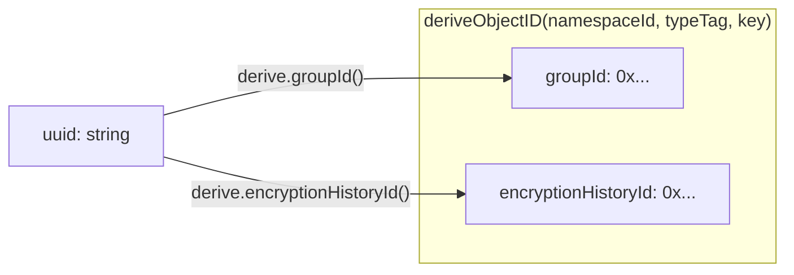

### Package Configuration

```typescript
type MessagingGroupsPackageConfig = {
  /** Original (V1) package ID. Used for TypeName strings, BCS, MyData namespace, deriveObjectID. */
  originalPackageId: string;
  /** Latest (current) package ID. Used for moveCall targets. Equals originalPackageId before upgrade. */
  latestPackageId: string;
  /** MessagingNamespace shared object ID. */
  namespaceId: string;
  /** Version shared object ID (contract upgrade version gating). */
  versionId: string;
};
```

### Session Key Configuration (3 Tiers)

```typescript
type SessionKeyConfig =
  // Tier 1: Signer-based (Keypair, etc.) ù fully automatic
  | { signer: Signer; ttlMin?: number; refreshBufferMs?: number }
  // Tier 2: Callback-based ù SDK creates, consumer signs via onSign callback
  | { address: string; onSign: (message: Uint8Array) => Promise<string>;
      ttlMin?: number; refreshBufferMs?: number }
  // Tier 3: Full manual control -- consumer manages entire lifecycle
  | { getSessionKey: () => Promise<SessionKey> | SessionKey };
```

---

## 13. Architecture Decision Records

### ADR-1: Group discovery via MySo GraphQL event queries

- **Context**: The SDK provides no direct "list groups for address" method. On-chain membership is stored per-group (dynamic fields), not per-user ù so there's no reverse index. However, the permissioned groups contract emits `MemberAdded<T>` and `MemberRemoved<T>` events containing both the member address and group ID. The MySo GraphQL API (indexer-backed) supports querying events by type and extracting structured fields via `MoveValue.extract()`.
- **Decision**: Use `MySoGraphQLClient` to query `MemberAdded` and `MemberRemoved` events filtered by the messaging package's event type. Extract `member` and `group_id` fields from each event, filter client-side for the connected address, and compute net membership (added minus removed). Cache results in localStorage for instant sidebar rendering on subsequent loads. Supplement with immediate cache updates on group creation and join-link flows.
- **Consequences**: Group discovery works across devices (any client can query the indexer). Client-side filtering is required since `EventFilter` doesn't support payload field filtering ù acceptable at testnet scale. localStorage serves as a performance cache, not the source of truth. Background refresh keeps the list current when external admins add the user to new groups.

### ADR-2: Tier 1 session keys with MySocial OAuth + derived keypair

- **Context**: The messaging SDK supports Tier 1 session keys (`{ signer }`) where a `Signer` (here, `Ed25519Keypair`) drives `SessionKey.create()` and certificate signing automatically. `@socialproof/mysocial-auth` authenticates users to MySocial and exposes `session.sub` plus `session.user.address`; the platform uses the salt service with Bearer auth to derive the same Ed25519 key that backs that address (`SHA256(sub + '_' + salt)` seed).
- **Decision**: Configure `encryption.sessionKey: { signer: keypair }`. Build PTBs with the SDK factories and execute them with `keypair.signAndExecuteTransaction()` + `client.core.waitForTransaction()` (`signAndExecuteTransactionAndWait` helper in `chat-app`).
- **Consequences**: No browser wallet extension. Wallet-only MySocial sessions (no API token / salt access) cannot derive a keypair; the UI explains that OAuth login is required. The derived private key remains in-memory for the SPA session lifetime (lost on full tab discard when using `storage: 'session'` for auth tokens depends on reload behavior documented by mysocial-auth).

### ADR-3: Atomic PTB for admin actions

- **Context**: Removing a member without rotating the key leaves them able to decrypt future messages if they have cached the DEK. These two operations must be atomic.
- **Decision**: Use the SDK `call` layer to compose `groups.call.removeMember` and `messaging.call.rotateEncryptionKey` as thunks added to a single `Transaction`. Execute with one `signAndExecuteTransaction` call.
- **Consequences**: Single signature prompt from the derived keypair, single gas fee, atomic execution. If either operation fails on-chain, both are rolled back. The `rotateEncryptionKey` thunk is async (it fetches the current key version and generates a new DEK) but resolves at `transaction.build()` time.

### ADR-4: Hybrid WebSocket + HTTP polling for real-time delivery

- **Context**: The relayer exposes HTTP CRUD plus `GET /v1/ws` for live encrypted message frames. Postgres `LISTEN/NOTIFY` coordinates cross-instance delivery (metadata only); each instance loads ciphertext from storage and pushes full wire JSON to WebSocket clients. The relayer never decrypts.
- **Decision**: Default to `HybridRelayerTransport` in the SDK ù WebSocket primary for `subscribe()`, HTTP polling fallback when WebSocket is disabled or fails. Set `realtime: 'poll'` to force polling only. CRUD and history fetch remain HTTP.
- **Consequences**: Foreground clients receive messages in ~1 RTT with no post-WS HTTP refetch. Polling remains available for restrictive networks and as a safety net. The `RelayerTransport` interface is unchanged for application code.

### ADR-5: File Storage quilt-based storage for attachments

- **Context**: Each message may have multiple file attachments. Uploading each file as a separate File Storage blob would be expensive and slow.
- **Decision**: Use File Storage quilts (`PUT /v1/quilts`) to batch multiple files into a single blob upload. Individual files are addressed by their `quiltPatchId` for download (`GET /v1/blobs/by-quilt-patch-id/{id}`).
- **Consequences**: Efficient batched uploads. Each attachment gets a unique `quiltPatchId` for independent download. Metadata (filename, MIME type) is encrypted separately and stored on the relayer, not on File Storage.

### ADR-6: DEK caching via ClientCache

- **Context**: Every message send/receive requires a DEK. MyData decryption involves network requests to threshold key servers and is expensive.
- **Decision**: Cache decrypted DEKs in `ClientCache` (the MySoClient's built-in cache) scoped under `'dek'`, keyed by `[groupId, keyVersion]`. DEK generation for new groups/rotations also warms the cache proactively.
- **Consequences**: First message in a group incurs MyData decryption overhead. Subsequent messages in the same session are fast. Key rotation creates a new cache entry for the new version while the old version remains cached (for decrypting older messages). The `clearCache()` method allows manual eviction if needed.

---

## 14. Environment Configuration

All configuration is provided via Vite environment variables (prefixed with `VITE_`), making them available at build time via `import.meta.env`.

```
# MySo Network
VITE_MYSO_NETWORK=testnet
VITE_MYSO_RPC_URL=https://fullnode.testnet.mysocial.network:9000
VITE_MYSO_GRAPHQL_URL=https://graphql.testnet.mysocial.network/graphql

# MySocial Login (register redirect URI allowlist per client ID)
VITE_MYSOCIAL_AUTH_API_BASE_URL=https://api.mysocial.network
VITE_MYSOCIAL_AUTH_ORIGIN=https://auth.mysocial.network
VITE_MYSOCIAL_AUTH_CLIENT_ID=your-client-id
VITE_MYSOCIAL_AUTH_REDIRECT_URI=http://localhost:5173/auth/callback
VITE_MYSOCIAL_SALT_URL=https://salt.testnet.mysocial.network/salt

# Package IDs (only needed for localnet/devnet ù testnet/mainnet auto-detected)
VITE_MESSAGING_ORIGINAL_PACKAGE_ID=0x...
VITE_MESSAGING_LATEST_PACKAGE_ID=0x...
VITE_MESSAGING_NAMESPACE_ID=0x...
VITE_MESSAGING_VERSION_ID=0x...

# Relayer
VITE_RELAYER_URL=http://localhost:3000

# File Storage (file attachments)
VITE_FILE_STORAGE_PUBLISHER_URL=https://publisher.file-storage-testnet.mysocial.network
VITE_FILE_STORAGE_AGGREGATOR_URL=https://aggregator.file-storage-testnet.mysocial.network
VITE_FILE_STORAGE_EPOCHS=1

# MyData Key Servers (threshold encryption)
VITE_MYDATA_KEY_SERVER_OBJECT_IDS=0x...,0x...,0x...
```

**Configuration flow:**

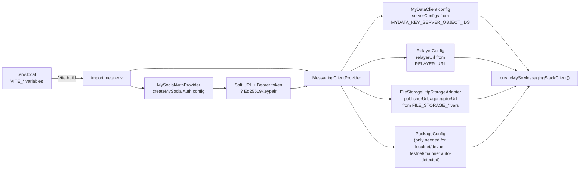

**Notes on package config:**

- For **testnet** and **mainnet**, the SDK auto-detects package IDs from the client's `network` property. The `VITE_*_PACKAGE_ID` variables are only needed for localnet/devnet deployments.
- The `originalPackageId` never changes after initial deployment (used for type names, BCS, MyData namespace). The `latestPackageId` is updated after contract upgrades (used for `moveCall` targets).
- The `namespaceId` and `versionId` are shared objects created during initial deployment and remain constant.
