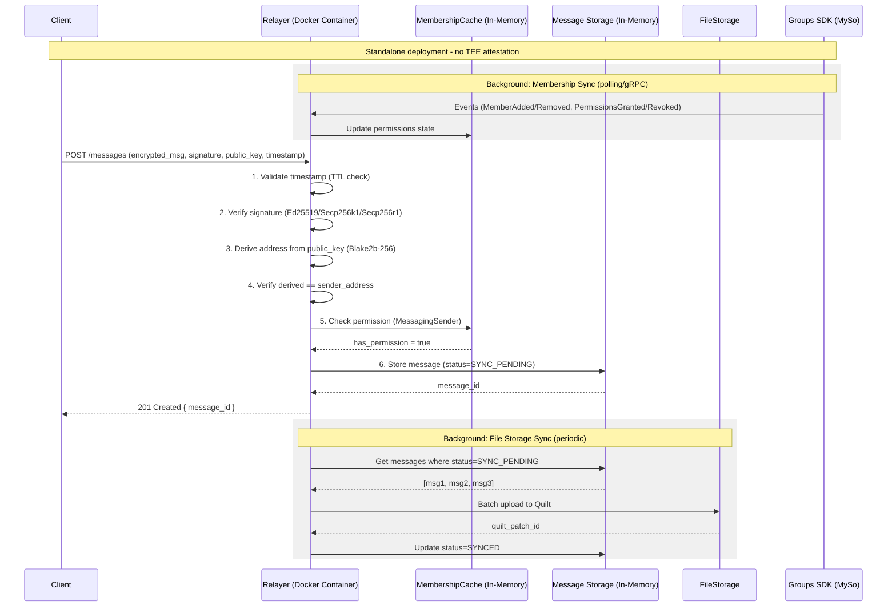
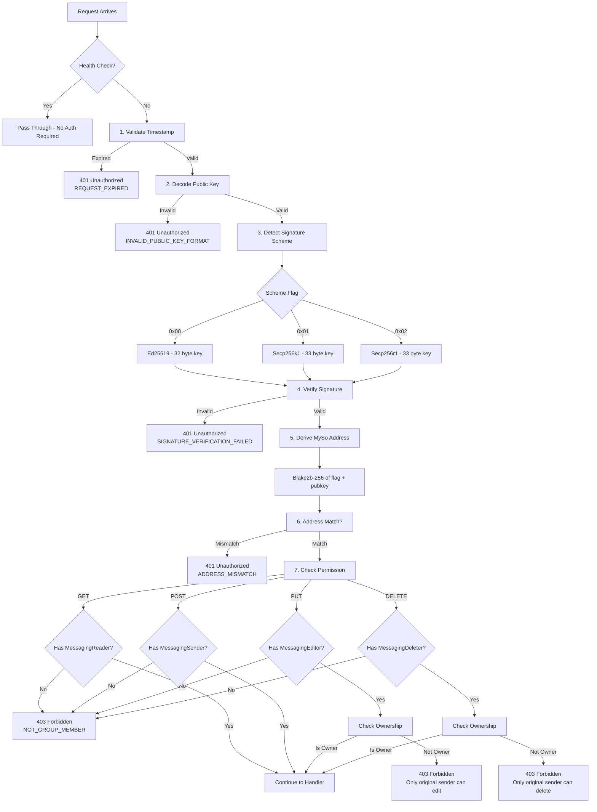
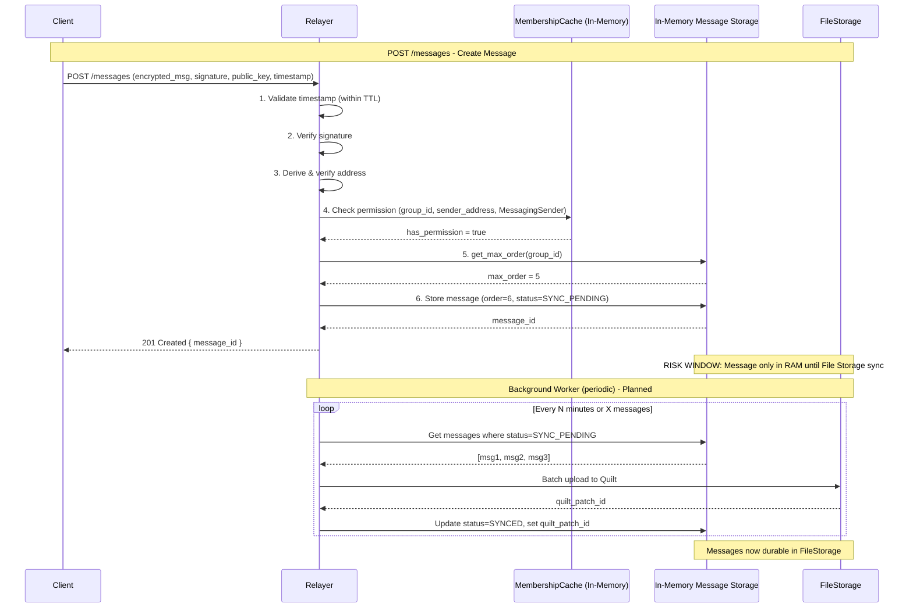
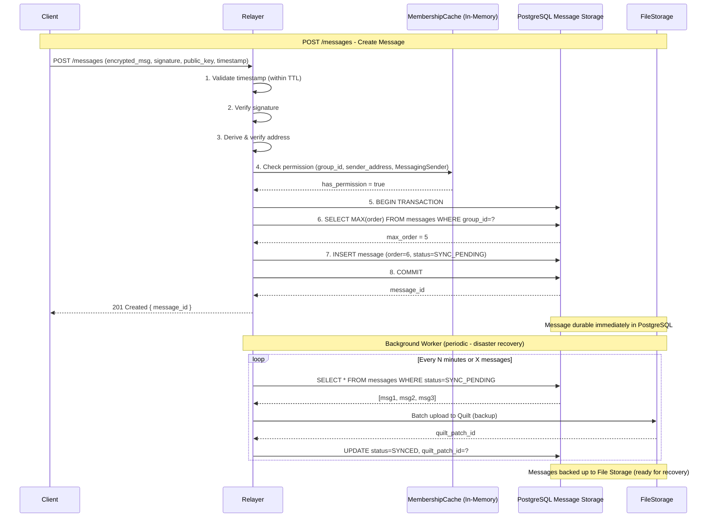
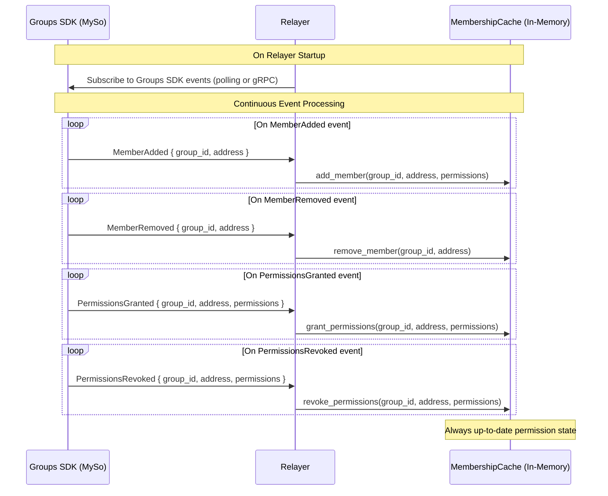
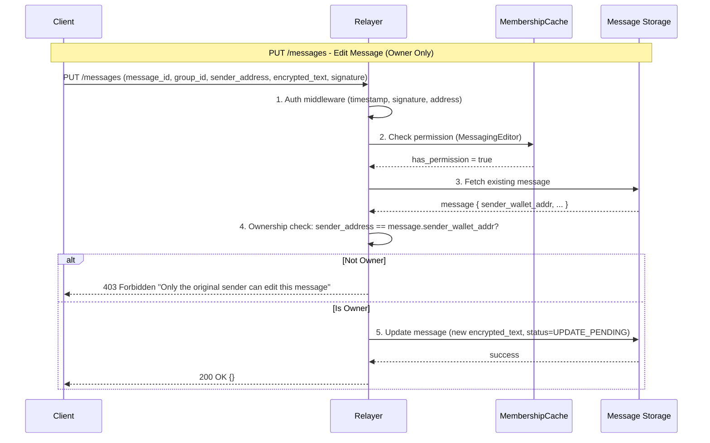
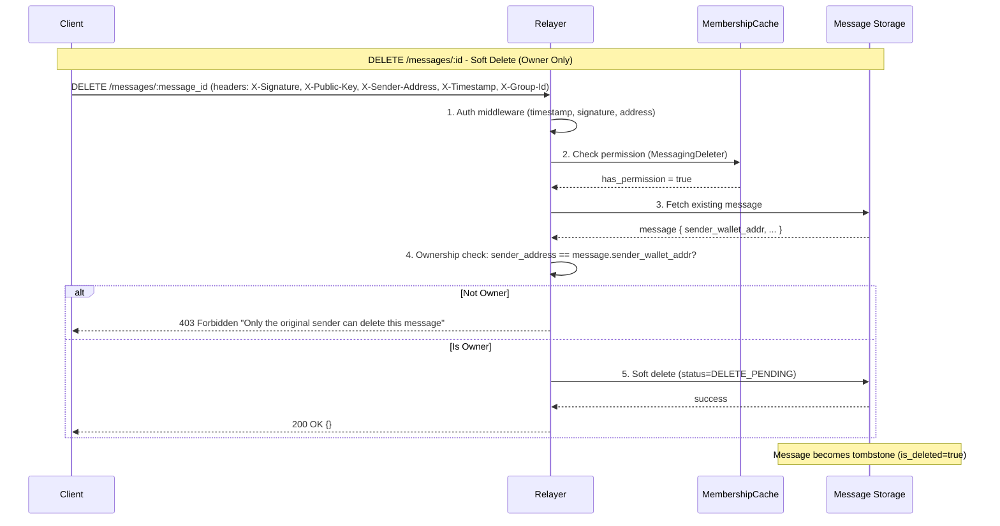
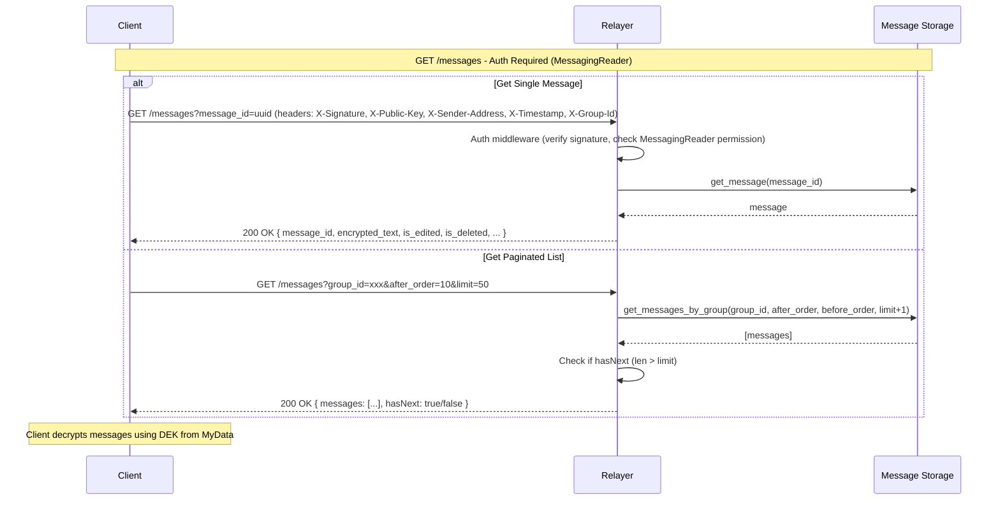
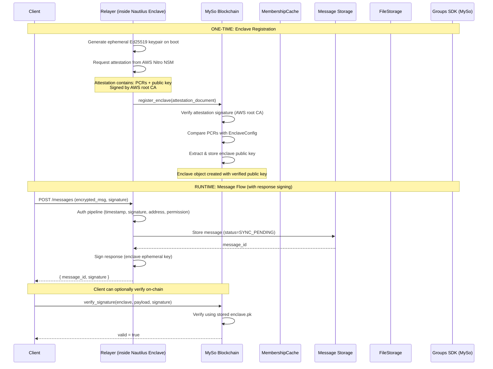

# Message Flow Diagrams

### Standalone Mode (Docker)

---

### Authentication Pipeline

---

### In-Memory Storage Mode 

---

### Permanent Storage Mode with DB (Optional)

---

### Membership Sync

---

### Message Edit Flow

---

### Message Delete Flow

---

### Get Messages Flow

---

## Future: TEE Enclave Mode (Nautilus on AWS Nitro)

