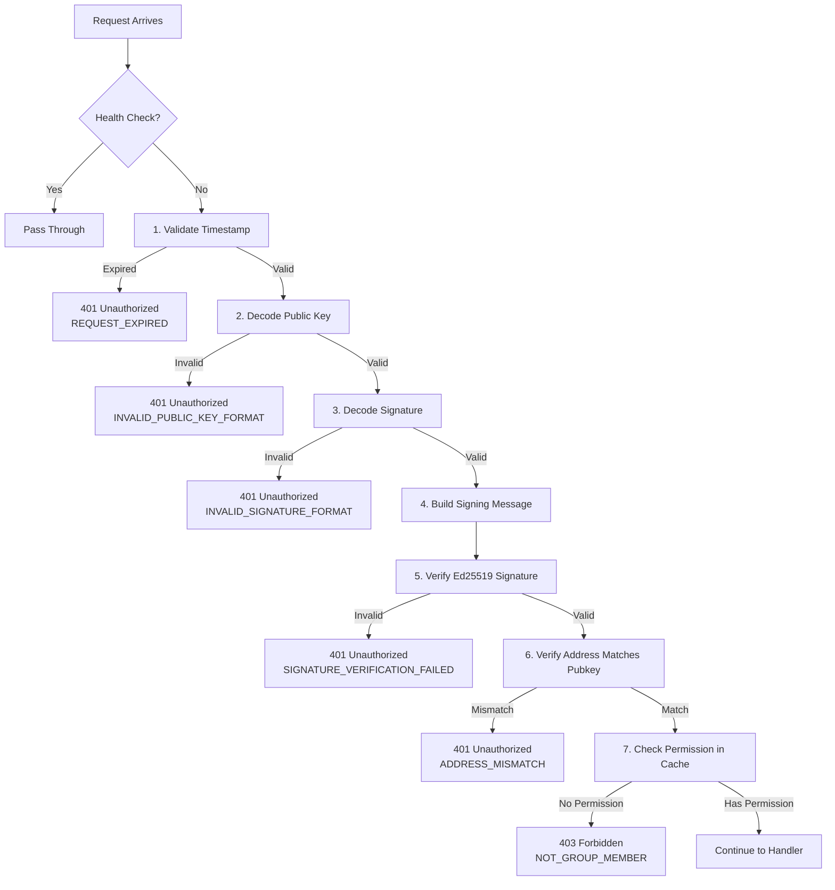
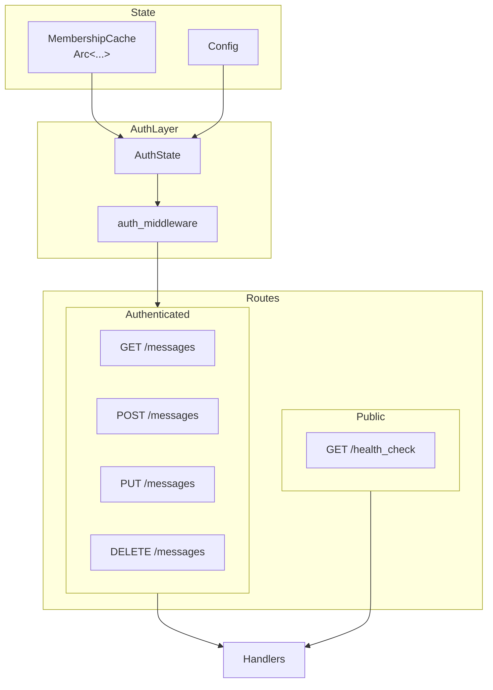
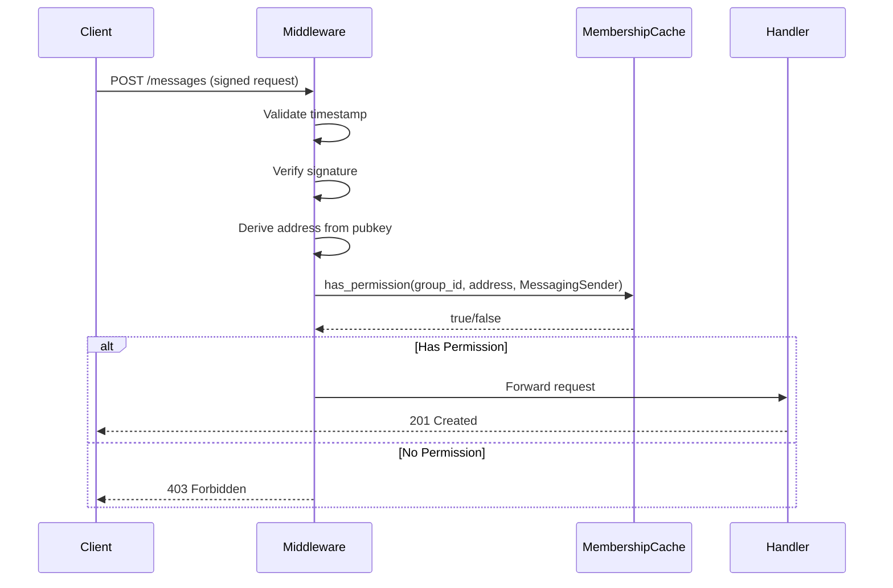
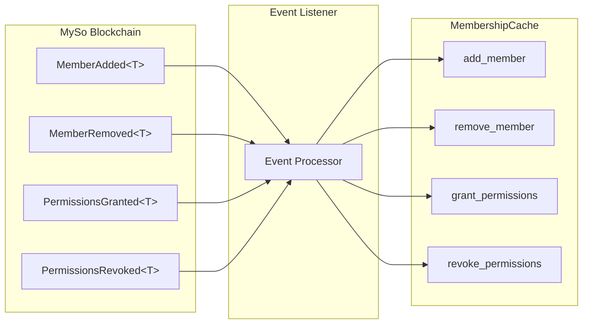

# Authentication System Documentation

This document describes the signature-based authentication layer for the messaging relayer, designed to integrate with the MySo Groups SDK.

## Overview

The system ensures only authorized group members can perform messaging actions by:

1. Verifying signatures (Ed25519, Secp256k1, or Secp256r1)
2. Validating timestamps for replay protection
3. Confirming MySo address ownership via public key derivation
4. Checking group-specific permissions

---

## Supported Signature Schemes

MySo supports three signature schemes, all fully implemented:

| Scheme | Flag | Public Key Size | Use Case |
|--------|------|-----------------|----------|
| **Ed25519** | `0x00` | 32 bytes | Most common, default MySo wallets |
| **Secp256k1** | `0x01` | 33 bytes (compressed) | Bitcoin/Ethereum compatible |
| **Secp256r1** | `0x02` | 33 bytes (compressed) | WebAuthn/passkeys, mobile devices |

---

## Core Components

### 1. Signature Schemes (`schemes.rs`)

Defines the `SignatureScheme` enum with methods:
- `from_flag(u8)` - Parse scheme from flag byte
- `flag()` - Get the scheme's flag byte
- `public_key_length()` - Expected key size in bytes

### 2. Permission Types (`permissions.rs`)

Defines the four messaging permissions from the Groups SDK smart contract:

| Permission | HTTP Method | Action |
|------------|-------------|--------|
| `MessagingSender` | POST | Send new messages |
| `MessagingReader` | GET | Read/decrypt messages |
| `MessagingEditor` | PUT | Edit existing messages |
| `MessagingDeleter` | DELETE | Delete messages |

The `from_type_name()` function parses MySo type strings like `0x123::messaging::MessagingSender` into enum variants.

---

### 3. Membership Cache (`membership.rs`)

Thread-safe in-memory store tracking which addresses have which permissions in which groups.

**Data structure:**

```
HashMap<group_id, HashMap<address, HashSet<Permission>>>
```

**Key operations:**

| Method | Purpose | Triggered By |
|--------|---------|--------------|
| `grant_permissions()` | Add permissions to member | `PermissionsGranted` event |
| `revoke_permissions()` | Remove permissions from member | `PermissionsRevoked` event |
| `add_member()` | Add member with initial permissions | `MemberAdded` event |
| `remove_member()` | Remove member entirely | `MemberRemoved` event |
| `has_permission()` | Check if address can perform action | Auth middleware |
| `is_member()` | Check if address has any permission | Auth middleware |

**Thread safety:** Uses `RwLock` for concurrent read access and exclusive write access.

---

### 4. Auth Middleware (`middleware.rs`)

Intercepts mutating requests and verifies authentication before reaching handlers.

#### Authentication Flow



#### Response Codes

| Status | Meaning |
|--------|---------|
| `401 Unauthorized` | Signature invalid, timestamp expired, or address mismatch |
| `403 Forbidden` | Valid authentication but missing required permission |

---

### 5. Request Format

Every authenticated request must include these headers:

| Header | Description |
|--------|-------------|
| `X-Signature` | Hex-encoded 64-byte raw signature |
| `X-Public-Key` | Hex-encoded (flag_byte \|\| public_key_bytes) |

For POST/PUT (requests with a body), the body includes `group_id`, `sender_address`, and `timestamp`. The entire body is the signed message.

For GET/DELETE (bodyless requests), additional headers are required:

| Header | Description |
|--------|-------------|
| `X-Sender-Address` | Sender's MySo wallet address |
| `X-Timestamp` | Unix timestamp (seconds) |
| `X-Group-Id` | Target group ID |

The signed message for bodyless requests is the canonical string: `"timestamp:sender_address:group_id"`.

---

## System Architecture

### Component Wiring



### Request Flow



---

## Security Properties

| Property | Implementation |
|----------|----------------|
| **Replay protection** | Timestamp must be within configurable TTL window |
| **Identity verification** | Signature verification (Ed25519/Secp256k1/Secp256r1) proves private key ownership |
| **Address binding** | MySo address derived from pubkey must match claimed address |
| **Authorization** | MembershipCache checks group-specific permissions |
| **Non-repudiation** | Signed requests can be verified later |

---

## Integration with Groups SDK

The membership cache will be populated by listening to MySo events:



---

## Testing

### Integration Test Coverage

| Test | Validates |
|------|-----------|
| `test_health_check_no_auth` | Public routes bypass authentication |
| `test_post_without_auth_fails` | Missing auth fields are rejected |
| `test_valid_auth_succeeds` (parameterized x3) | Full auth flow for Ed25519, Secp256k1, Secp256r1 |
| `test_no_permission_returns_403` (parameterized x3) | Valid signature + no permission = 403 for all schemes |
| `test_expired_timestamp_rejected` | Replay protection works |
| `test_address_mismatch_rejected` | Wrong address is rejected |
| `test_invalid_signature_rejected` | Bad signature is rejected |
| `test_get_messages_requires_auth` | GET requests require authentication |
| `test_get_messages_with_valid_auth_succeeds` | Authenticated GET returns messages |
| `test_delete_own_message_succeeds` | Owner can delete their message |
| `test_delete_other_users_message_returns_403` | Non-owner cannot delete |

### Running Tests

```bash
cargo test
```

---

## File Structure

```
src/auth/
├── mod.rs              # Module exports
├── middleware.rs       # Axum auth middleware
├── membership.rs       # MembershipCache implementation
├── permissions.rs      # MessagingPermission enum
├── schemes.rs          # SignatureScheme enum (Ed25519, Secp256k1, Secp256r1)
├── signature.rs        # Multi-scheme signature verification utilities
├── types.rs            # AuthContext, AuthError, and shared types
└── README.md           # This documentation
```
